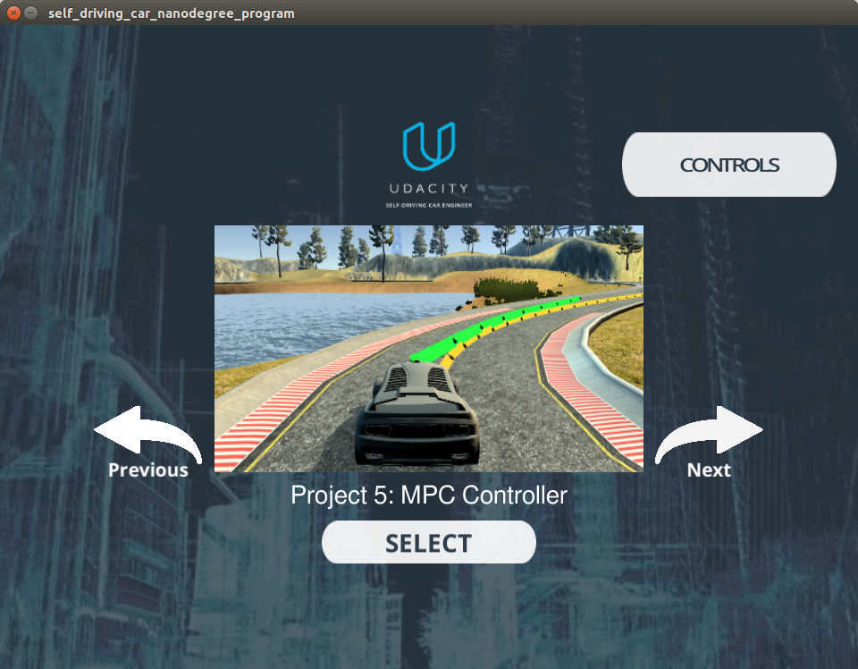

# Model predictive control
Model predictive control project for longitudinal and lateral control of the autonomous vehicles. It uses udacity vehicle simulator. [self driving car engineer course](https://www.udacity.com/course/self-driving-car-engineer-nanodegree--nd013) 
- - -
### Getting started
These instructions will help running this project on your local machine.

#### Prerequisites
##### 1. Basic environment
Please install all the dependencies first by using this  [repository](https://github.com/udacity/CarND-MPC-Project) which is for self-driving car engineer course of udacity.
```
cmake >= 3.5
-std=c++11
ipopt
CppAD
```
##### 2. Udacity vehicle simulator
1. Install git-lfs
git-lfs is github platform for large file handling. You can easily install it on the official github [site](https://git-lfs.github.com/) 

2. Install Unity
Udacity simulator is made by unity. To run the simulator, Unity is necessary.
```
1. sudo apt install gdebi
2. wget http://beta.unity3d.com/download/ee86734cf592/unity-editor_amd64-2017.2.0f3.deb
3. sudo gdebi unity-editor_amd64-2017.2.0f3.deb
```

- - -
### Running the project
On terminal
```
mkdir build && cd build
cmake .. && make
./mpc
```
Open the simulator
```
1. Open term2_sim_linux/term2_sim.x86_64
2. Select graphic quality
3. Select Project 5: MPC Controller
```



### Result

- - -
### Additional features
To analyze the performance of the controller more precisely, I added the logging class for data logging. If logging signal is needed, it can be logged by .json format. For example, logSteering class instance shows how to log the signal as .json (You can find it main.cpp).
